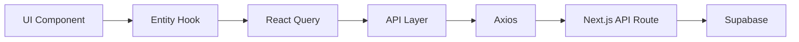
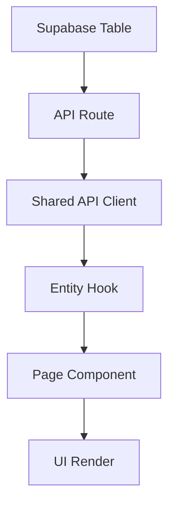

# Архитектура проекта

## Обзор архитектуры

Проект построен на основе методологии **Feature Sliced Design (FSD)** в сочетании с **Next.js App Router**. Это обеспечивает четкую структуру, масштабируемость и поддерживаемость кода.

## Основные принципы

### 1. Feature Sliced Design (FSD)

FSD - это архитектурная методология для фронтенд-проектов, которая разделяет код на слои и слайсы:

```
fsd/
├── app/        # Инициализация приложения
├── pages/      # Страницы
├── entities/   # Бизнес-сущности  
├── features/   # Фичи (в данном проекте пока не используется)
├── shared/     # Переиспользуемый код
└── widgets/    # Композитные компоненты (в данном проекте пока не используется)
```

**Правила потока данных:**
- Вышестоящие слои могут импортировать из нижестоящих
- Нижестоящие слои НЕ знают о вышестоящих
- Слайсы внутри одного слоя изолированы друг от друга

### 2. Next.js App Router

Next.js 15 с App Router обеспечивает:
- Серверные компоненты по умолчанию
- Вложенные layouts
- API Routes в той же структуре
- Группировка роутов без влияния на URL

```
app/
├── (client)/       # Группа клиентских роутов
│   ├── layout.tsx  # Обертка с TelegramContext
│   └── page.tsx    # Главная страница
├── admin/          # Административная панель
├── api/            # API endpoints
└── layout.tsx      # Корневой layout
```

## Слои архитектуры

### App Layer (`/fsd/app`)

**Назначение**: Инициализация приложения, провайдеры, глобальные стили

**Структура**:
```
app/
├── providers/
│   ├── AntdWrapper.tsx        # Ant Design конфигурация
│   ├── ReactQueryProvider.tsx # React Query setup
│   ├── TelegramContext.tsx    # Telegram SDK контекст
│   ├── TelegramUser.tsx       # Автосоздание пользователя
│   └── ClientPage.tsx         # Обертка для клиентских страниц
└── styles/
    └── globals.css            # Глобальные стили
```

**Ключевые компоненты**:

1. **TelegramContext** - управляет Telegram WebApp SDK:
   - Определение окружения (Telegram/браузер)
   - Инициализация SDK
   - Управление UI (fullscreen, swipe behavior)
   - Haptic feedback

2. **TelegramUser** - автоматическая регистрация пользователей:
   - Извлечение данных из Telegram
   - Upsert в базу данных
   - Обновление контекста приложения

3. **ReactQueryProvider** - настройка React Query:
   - Конфигурация кэширования
   - Настройки повторных запросов
   - DevTools в development

### Entities Layer (`/fsd/entities`)

**Назначение**: Бизнес-сущности и их логика

**Структура**:
```
entities/
├── users/
│   ├── hooks/
│   │   ├── useTgUser.ts       # Получение пользователя
│   │   └── useUpsertTgUser.ts # Создание/обновление
│   └── types.ts               # Типы пользователя
├── lessons/
│   ├── hooks/
│   │   └── useLessons.ts      # Получение уроков
│   └── types.ts               # Типы уроков
└── types.ts                   # Общие типы
```

**Принципы**:
- Каждая сущность изолирована
- Хуки используют React Query
- Типы экспортируются для переиспользования

### Pages Layer (`/fsd/pages`)

**Назначение**: Компоненты страниц

**Структура**:
```
pages/
└── client/
    ├── MainPage.tsx    # Главная страница
    └── LessonsPage.tsx # Страница уроков
```

**Особенности**:
- Импортируют из entities и shared
- Содержат бизнес-логику страницы
- Используются в app/ роутах

### Shared Layer (`/fsd/shared`)

**Назначение**: Переиспользуемый код

**Структура**:
```
shared/
├── api/
│   ├── index.ts        # Axios instance
│   ├── users/          # User API
│   ├── lessons/        # Lessons API
│   └── react-query.ts  # Query client
├── clients/
│   └── supabaseClient.ts # Supabase setup
└── components/
    ├── BottomMenu.tsx  # Навигация
    └── ClientUnsupported.tsx # Заглушка
```

## Поток данных

### 1. Инициализация приложения

```mermaid
graph TD
    A[Next.js App] --> B[Root Layout]
    B --> C[Providers Setup]
    C --> D[AntdWrapper]
    C --> E[ReactQueryProvider]
    B --> F[(client) Layout]
    F --> G[TelegramContext]
    G --> H[TelegramUser]
    H --> I[Page Component]
```

### 2. Работа с данными



### 3. Создание новой сущности (пример)



## Конфигурация окружения

### TypeScript Configuration

```json
{
  "compilerOptions": {
    "strict": true,
    "baseUrl": ".",
    "paths": {
      "@/*": ["./*"],
      "@fsd/*": ["./fsd/*"]
    }
  }
}
```

### Environment Variables

```env
# API Configuration
NEXT_PUBLIC_API_URL=

# Supabase (Public)
NEXT_PUBLIC_SUPABASE_URL=
NEXT_PUBLIC_SUPABASE_ANON_KEY=

# Supabase (Server)
SUPABASE_URL=
SUPABASE_SERVICE_ROLE_KEY=
```

## Паттерны и best practices

### 1. Клиент-серверное разделение

- Используйте `"use client"` только когда необходимо
- API Routes для серверной логики
- Серверные компоненты для статического контента

### 2. Управление состоянием

- **Server State**: React Query
- **Client State**: useState/useContext
- **Global State**: Context API

### 3. Типизация

- Строгая типизация всех данных
- Переиспользование типов из entities
- Zod для валидации (при необходимости)

### 4. Обработка ошибок

- Try-catch в API routes
- Error boundaries для UI
- Fallback компоненты

### 5. Производительность

- Lazy loading страниц
- React Query кэширование
- Оптимизация изображений Next.js

## Безопасность

### 1. API Security

- Валидация входных данных
- Проверка Telegram подписи
- Rate limiting (при необходимости)

### 2. Environment Variables

- Разделение на публичные и приватные
- Использование NEXT_PUBLIC_ префикса
- Хранение чувствительных данных на сервере

### 3. Database Security

- Row Level Security в Supabase
- Service role key только на сервере
- Prepared statements для запросов

## Масштабирование

### Добавление новых слоев FSD

При росте проекта можно добавить:

```
fsd/
├── features/   # Пользовательские сценарии
├── widgets/    # Композитные блоки
└── processes/  # Бизнес-процессы
```

### Микрофронтенды

Структура поддерживает разделение на модули:
- Независимые entities
- Изолированные pages
- Общий shared слой

### Оптимизация бандла

- Code splitting по роутам
- Dynamic imports для тяжелых компонентов
- Tree shaking неиспользуемого кода